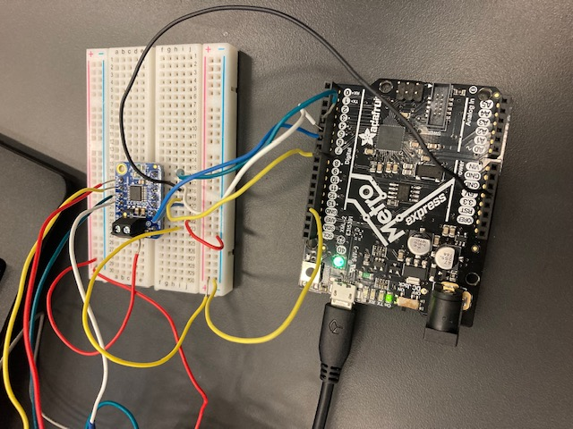

# SCARA-ROBOTIC-ARM
A scara robotic arm is a arm that can do many different things such as drawing, playing game and lots of other fun things. We're creating a robotic arm that will write out letters. We wanted this because we wanted to try something challenging and different that we have never thought of making. Made by Mariam and Malachi 

This is our Onshape link 
[Onshape Link](https://cvilleschools.onshape.com/documents/61e764f56fafef002ee169bb/w/db2ca47ead6d9adc5cc374b3/e/7a9d3a3022fa10662d8f42b8?renderMode=0&uiState=61b21e949aba4d645b01b5f5)

## Table of Contents
* [Table of Contents](#TableOfContents)
* [Project prep questions](#Project_prep_questions)
* [Pictures of our progress](#Progress_pictures)
* [Proof of concept](#Proof_of_concept)
* [How the code works](How_the_code_works)
* [Final Reflections](#Final_Reflections)

### The final project pricture 
This is the final look of scara robotic arm.

## Project_prep_questions

### What is the problem you are trying to solve?
How to control the robot movement/ giving them commands? 
How are we gonna work out the calculations? 

### What are the requirements for this assignment?

The requirements for this project are arduino, stepper motor, maybe a servo, pen, wires, drive motor, Acrylic Sheet, battery pack with batteries, and bolts and nuts.

2 stepper motors control each of the 2 arms, servo will control the height of the pen

### Proof_of_concept

### what is our Proof of concept? 
Getting the stepper motor to move 

Getting it to move using a prototyping shield

Both stepper motors moving together

### Images

5v will be unplugged, 9v battery will be plugged into correlating positive and negative collumns on far side of breadboad, wires from motor controller in positive and negative slots will be plugged into correlating positive and negative lanes in the same column of where the battery is plugged in.

### Progress_pictures
At first we wanted to make our robot like this,but than ater we came up with a different design. 

 

[Image credit goes to instructables.com](https://www.instructables.com/DIY-SINGLE-ARM-SCARA-ROBOT/)

### How_the_code_works

### Description for code

### Robotic planning, assembly and measurements 

### Final Reflections

### Coding Reflection- Malachi 

### Cad Reflection- Mariam 

                                                                                                                        
### Resources 
[Scara robot](https://www.instructables.com/DIY-SINGLE-ARM-SCARA-ROBOT/)

[single arm scara robot arm](https://github.com/tuenhidiy/SINGLE-ARM-SCARA-ROBOT)

[stepper motor code](https://learn.adafruit.com/adafruit-tb6612-h-bridge-dc-stepper-motor-driver-breakout/python-circuitpython) 
